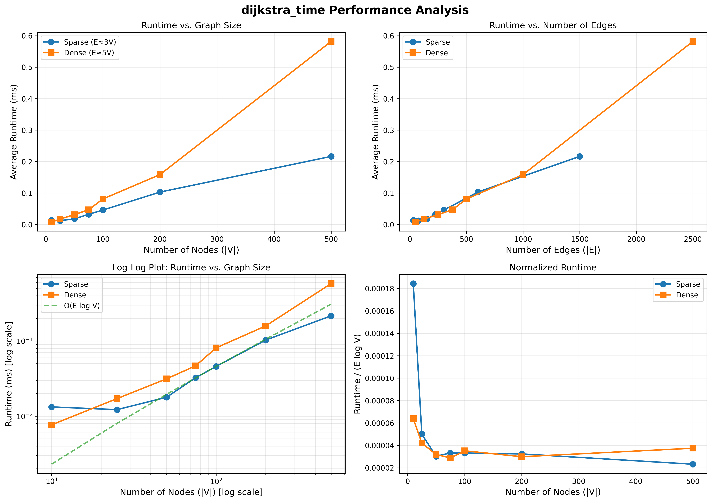

# Time Complexity Analysis

**Input Parameters:**
- `|V|` = number of nodes
- `|E|` = number of edges

Initialization: O(V)
Main Loop: O(V) iterations of O(log E)
- Each node is added to `visited` at most once, so the loop will run `O(V)` iterations at most. Then, for each node, the edges are explored and pushed to a heap at O(log E).
Edge processing: O(E log E)

**Total Time Complexity: O((V + E) log E)**

Since E >= V - 1, assuming a connected graph, this simplifies to:

**Time Complexity: O(E log E)**
- Or an equivalent O(E log V) since E <= V^2

### Bottleneck Analysis
- Heap operations: O(log E)
- Number of heap operations: O(E) pushes + O(V) pops
### Comparison to Standard Dijkstra
- Time Complexity: O(E + V log V) or equivalently O(E log V)

**Conclusion: Same time complexity**

# Space Complexity Analysis

**Space Usage:**
- dist dictionary: O(V)
- prev dictionary: O(V)
- visited set: O(V)
- Priority queue: O(E) in the worst case
- Time window data: O(V)

**Total Space Complexity: O(V + E)**

**Conclusion: Same space complexity**
- But realistically, some extra space is used to store the time window data

# Experimental Validation

*Runtime graph created with numpy and matplotlib*

Tested with graph sizes of 10, 25, 50, 75, 100, 200, and 500. Two different graphs of different densities were utilized at each size; a sparse graph with 3 average edges per node, and a dense graph with 5 average edges per node.

**Expectation: O(E log V) time complexity**

The normalized runtime converges to a constant of **~0.000025-0.000040** confirming O(E log V) complexity.

The main discrepancy is the increased runtime of the dense graph at V=500. This can be explained by the randomization generating a graph with ~2500 edges, a huge increase over previous trials, thus the increased runtime is expected. 

However, the average runtime is still 0.5818 ms, around half a millisecond, demonstrating practical efficiency.

**Conclusion: The empirical results validate our theoretical time complexity.**