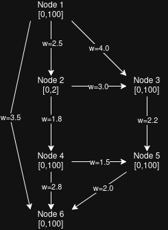
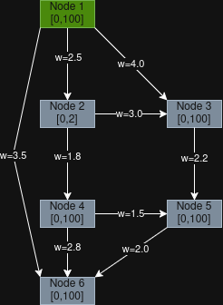
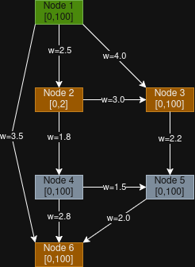
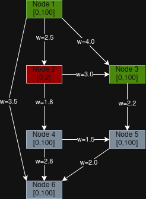
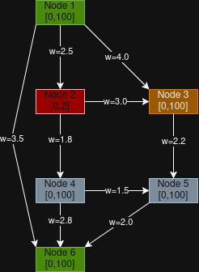
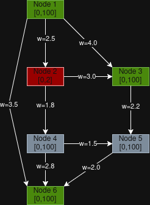

# Correctness Proof

## Assumptions:

- Edge weights w(u,v) >= 0
- Every node, u, has optional time windows where earliest_u <= latest_u
- At any node, if arrival_time < earliest_u, we can wait until earliest
- The algorithm starts at the base node at time 0
- The start node must satisfy its time window

## Node and Time Window Graph

## Loop Invariant Visualization
Invariant: For every node u in the visited set, earliest_arrival[u] represents the optimal feasible arrival time at u which satisfies u's time window.

Assuming a Dijkstra's algorithm to find a path from 1 to 3:

**Key:**
- Green: Visited
- Yellow: In priority queue
- Gray: Unvisited
- Red: Pruned (Violates the time constraint)
### Step 1: Initial State

### Step 2: Processing Node 1

### Step 3: Attempt Node 2 
w=2.5 > 2, violating the constraint, so 2 is rejected. The invariant still holds.

### Step 4: Attempt Node 6 (Accepted)

### Step 5: Attempt Node 3 (Destination)

## Counterexample:

Under the assumption that waiting is allowed at any node, the algorithm *will* find a feasible path if one exists. The algorithm explores nodes in order of arrival, but the node is only pruned if arrival > latest. If arrival < earliest, then the algorithm will wait until the earliest and continue.

As such, if a feasible path exists, then there is a path where each node can be reached within it's time window. Since waiting is allowed, any early arrival can be fixed by waiting. This will find the path, or an equivalent one. The only way to fail is if the graph is disconnected, or all paths violate lateness time constraints, even with waiting.

Thus, there is no viable counterexample under which the algorithm fails to find a feasible path assuming there is one, unless the graph is disconnected (no path exists), or all paths contain a node in which arrival > latest.